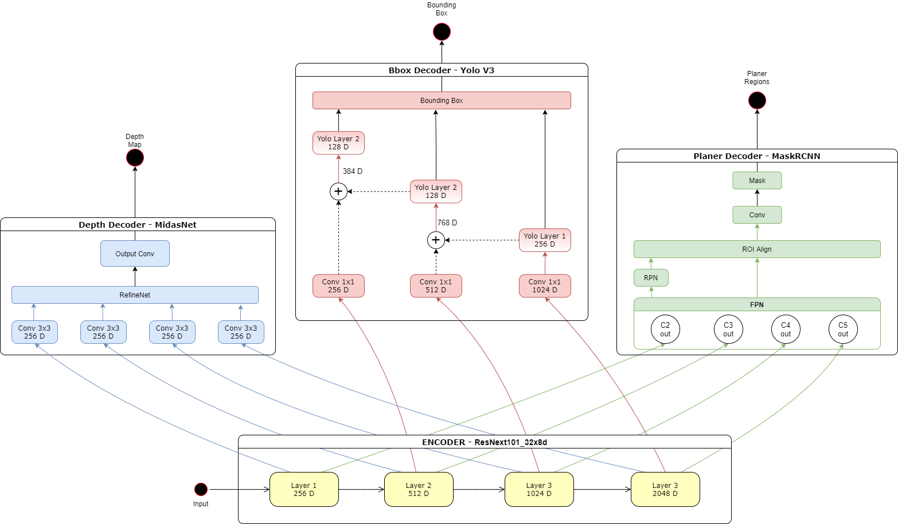

<h1 align="center">Projekt Triclops ☘️</h1>

Triclops - from the DragonBallZ world - is ancient group of three-eyed aliens.

---

Projekt Triclops: A DNN for object detection, segmentation and depth estimation. The entire dataset was 
created from scraping images. The DNN was custom made inspired from Encoder-Decoder architecture.

The idea here is to create a single network that can perform 3 different tasks 
simultaneously:

- Able to perform Object Detection
- Able to perform Depth Map Generation
- Able to perform Plane Surface Identification

# Architecture

<!-- 
 -->

<!-- 
 -->

# Dataset
The data used for the training of the model is scraped from the internet for
people wearing hardhat, masks, PPE and boots.
The idea here is to use pre-trained networks and use their outputs as the ground truth data:

 - MidasNet Network for depth maps
 - Yolov3 Network for object detection
 - PlanerCNN Network for identifying plane surfaces

The steps taken to create the dataset are:

1. For object detection - use YoloV3 annotation tool to draw bounding box for the labels and 
generate required files as mentioned here.
2. Use MidasNet by Intel to generate the depthmap for the above images.
3. Use Planercnn to generate plane segmentations of the above images.

#### *Upcoming*
A Youtube Video of indoor surfaces will be used create additional data by generating frames from video
and then used them to generate the PlanerCNN output.

# Model Development

The model is based on Encoder-Decoder Architecture. The strategy is to use a common backbone
and pass the final activations from the encoder to three different decoders.

### Encoder  
Each of the three different networks were using three different backbones : 

MidasNet - ResNext101_32x8d_wsl

Planercnn - ResNet101

Yolov3 - Darknet-53

ResNext101 - This has been finalised as the encoder as this is being offered by facebook and 
is trained on millions of images.

### *Upcoming*
1. The Dataset and Dataloaders are in developement. After this the data(images) can be loaded 
in dataloaders for each type of decoder.

2. Then the training loop will be setup.

3. Loss functions will be identified and experimented.

4. Inference loop will be developed.

5. Code documentation and project documentation.

